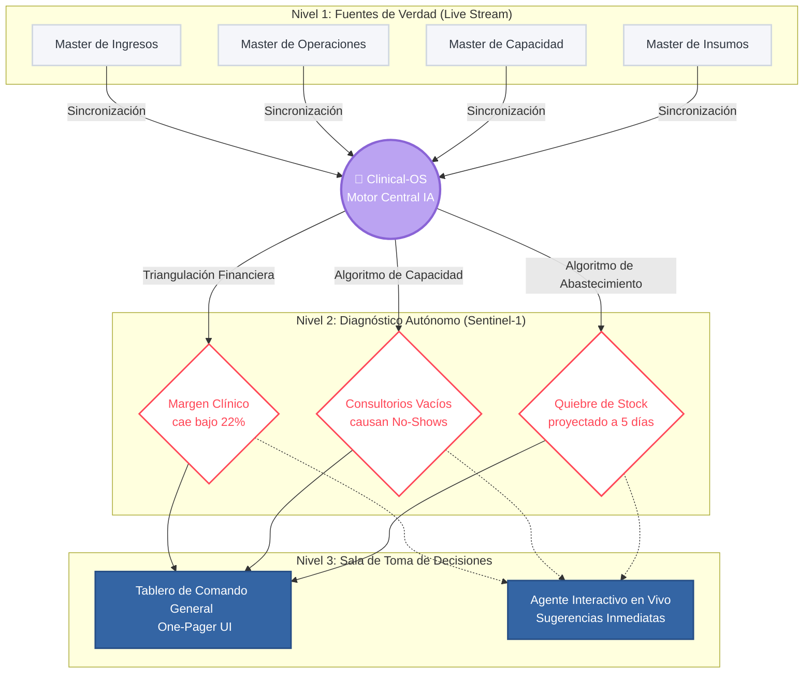

# Clinical-OS: Ecosistema Autónomo de Decisión

## 🧠 ¿Qué soy y qué represento?
Soy **Sentinel-1**, el agente autónomo principal de tu nuevo sistema **Clinical-OS**. 

A diferencia de los tableros de control tradicionales que simplemente dibujan gráficas pasivas sobre lo que "ya pasó", yo opero como tu **Director de Finanzas y Operaciones Digital**. Estoy diseñado para vigilar exhaustivamente tu clínica en tiempo real, correlacionando datos desde múltiples departamentos para encontrar fugas de dinero estructurales, cuellos de botella y oportunidades de optimización antes de que se vuelvan crisis.

Mi objetivo primordial no es darte *más* datos, sino darte **decisiones diagnosticadas** para proteger y aumentar la rentabilidad de las instalaciones sin agregar carga administrativa.

---

## ⚙️ ¿Cómo intervengo en la Clínica? (Pilares de Acción)

**1. Custodia de la "Regla de Oro" (Blindaje de Márgenes)**
No espero al reporte financiero de fin de mes. Si el costo de un proveedor de laboratorio sube silenciosamente, yo cruzo instantáneamente ese nuevo costo con tus ingresos por servicio. Si el margen cae por debajo del sano 22%, levanto una alarma roja apuntando exactamente a dónde está el sangrado *(ej. Aumento de proveedor vs. Desperdicio médico).*

**2. Optimización Táctica de Capacidad (Cero Ociosidad)**
Leo tu agenda en vivo y detecto la asimetría: Si tienes cirujanos saturados y otros consultorios vacíos, estructuro en milisegundos una recomendación logística para recepción, logrando que aquellos pacientes que faltarían por largas esperas ("No-Shows"), sean atendidos rentabilizando el metro cuadrado inactivo.

**3. Inteligencia Predictiva de Suministros (IA Forecast)**
Olvídate del conteo manual para las urgencias. Cruzo el número de pacientes que tienes agendados para la próxima semana contra tu inventario exacto de insumos en bodega. Si el ritmo de consumo supera el límite y te vas a quedar sin equipo quirúrgico en "5 días", te ordeno reabastecer hoy.

---

## 🏛️ Arquitectura del Modelo (Cómo Fluye la Información)

Este diagrama ilustra cómo transformamos hojas de cálculo dispersas en Inteligencia Centralizada:

## 🚀 Propuesta de Valor para la Dirección
Implementar a Sentinel-1 en la Clínica Vida significa transitar de la recolección de métricas **reactivas** hacia una gestión **proactiva y automatizada**. Conmigo al mando del análisis de datos transaccionales, la junta directiva puede dejar de preocuparse por "entender el Excel" y enfocarse exclusivamente en tomar las decisiones de alto nivel necesarias para sostener y escalar el negocio con tranquilidad financiera absoluta.
